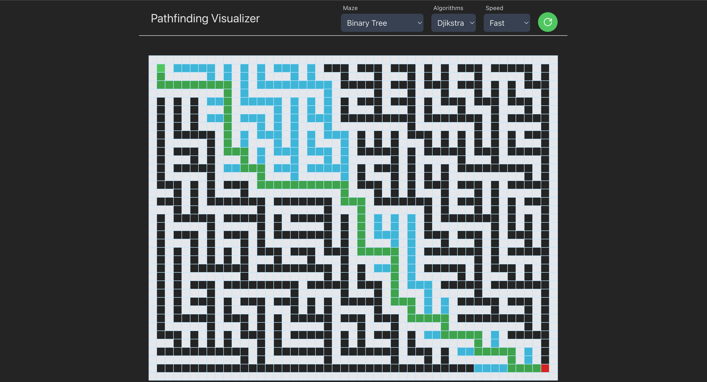

# 🧭 Maze-Pilot | Pathfinding Visualizer

An interactive and animated pathfinding visualizer built with **React**, **TypeScript**, and **Tailwind CSS**. Supports multiple maze generation and pathfinding algorithms with customizable speed and manual grid editing.

---

### 🖥️ Main Visualizer View


---

## ✨ Features

- 🎯 **Algorithms**: Dijkstra, Breadth-First Search (BFS), and Depth-First Search (DFS)
- 🧱 **Maze Generators**: Binary Tree, Recursive Division, or Manual Drawing
- 🖱️ **Interactive Grid**: Click-and-drag wall placement with optimized performance
- ⏱️ **Speed Control**: Toggle between Slow, Medium, and Fast animation speeds
- ⚛️ **Global State**: Modular state using React Context API and custom hooks
- 🎨 **Responsive Design**: Fully styled with Tailwind CSS, accessible and mobile-friendly UI
- 🛠️ **Strong Typing**: TypeScript interfaces for tiles, grid, algorithms, and animation
- 📦 **Code Quality**: Scalable structure with separation of concerns and reusable components

---

## 🛠️ Getting Started

Follow these steps to run the project locally:


```bash

### 1. Clone the Repository
git clone https://github.com/yourusername/pathfinding-visualizer.git
cd pathfinding-visualizer

###2. Install Dependencies
npm install

###3. Run the Development Server
npm run dev
The app will be available at: http://localhost:5173
```

